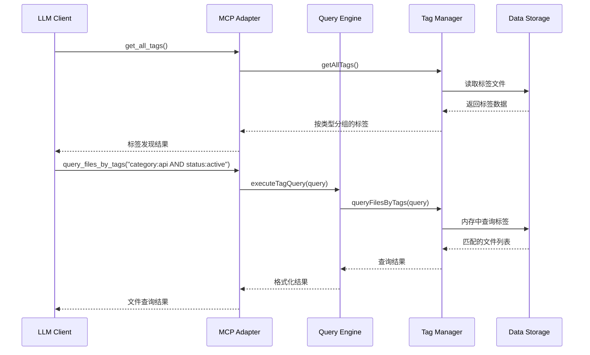
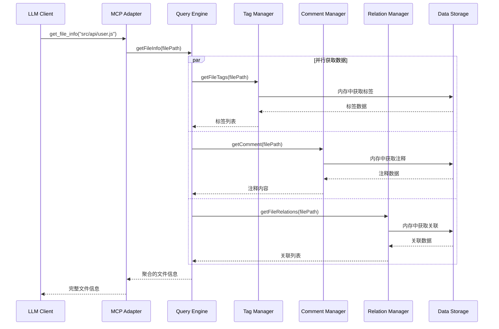

# CodeNexus 系统设计文档

## 概述
本文档描述了 CodeNexus 代码库关系管理工具的系统设计，基于修改后的需求文档，专注于标签驱动的文件管理和关联关系构建，移除了注释搜索功能。

## 术语与概念定义
- **标签管理器**: 负责文件标签的增删改查和标签发现功能
- **注释管理器**: 负责文件注释的存储和获取，不提供搜索功能
- **关联管理器**: 负责文件间关联关系的管理
- **查询引擎**: 负责复杂查询逻辑的处理和结果聚合
- **MCP适配器**: 负责MCP协议的实现和接口暴露
- **数据存储层**: 负责数据的持久化存储

## 系统架构

### 整体架构
```
┌─────────────────┐    ┌─────────────────┐    ┌─────────────────┐
│   LLM Client    │    │   CLI Client    │    │  Other Clients  │
└─────────────────┘    └─────────────────┘    └─────────────────┘
         │                       │                       │
         └───────────────────────┼───────────────────────┘
                                 │
                    ┌─────────────────┐
                    │  MCP Adapter    │
                    └─────────────────┘
                                 │
                    ┌─────────────────┐
                    │  Query Engine   │
                    └─────────────────┘
                                 │
         ┌───────────────────────┼───────────────────────┐
         │                       │                       │
┌─────────────────┐    ┌─────────────────┐    ┌─────────────────┐
│  Tag Manager    │    │Comment Manager  │    │Relation Manager │
└─────────────────┘    └─────────────────┘    └─────────────────┘
         │                       │                       │
         └───────────────────────┼───────────────────────┘
                                 │
                    ┌─────────────────┐
                    │ Data Storage    │
                    └─────────────────┘
```

### 核心组件设计

#### 1. 标签管理器 (TagManager)
**职责**:
- 文件标签的增删改查
- 标签格式验证 (type:value)
- 标签发现功能
- 批量标签操作

**核心方法**:
```typescript
interface TagManager {
  addTags(filePath: string, tags: string[]): Promise<void>
  removeTags(filePath: string, tags: string[]): Promise<void>
  getFileTags(filePath: string): Promise<string[]>
  queryFilesByTags(query: string): Promise<string[]>
  getAllTags(): Promise<Record<string, string[]>>
  getUntaggedFiles(): Promise<string[]>
  validateTag(tag: string): boolean
}
```

#### 2. 注释管理器 (CommentManager)
**职责**:
- 文件注释的存储和获取
- 注释的更新和删除
- 批量注释查询

**核心方法**:
```typescript
interface CommentManager {
  addComment(filePath: string, comment: string): Promise<void>
  updateComment(filePath: string, comment: string): Promise<void>
  getComment(filePath: string): Promise<string | null>
  getComments(filePaths: string[]): Promise<Record<string, string>>
  deleteComment(filePath: string): Promise<void>
}
```

#### 3. 关联管理器 (RelationManager)
**职责**:
- 文件关联关系的管理
- 关联描述的搜索
- 双向关联查询

**核心方法**:
```typescript
interface RelationManager {
  addRelation(fromFile: string, toFile: string, description: string): Promise<void>
  removeRelation(fromFile: string, toFile: string): Promise<void>
  getFileRelations(filePath: string): Promise<Relation[]>        // 出向关联
  getIncomingRelations(filePath: string): Promise<Relation[]>    // 入向关联
  queryRelationsByDescription(keyword: string): Promise<Relation[]>
}
```

#### 4. 查询引擎 (QueryEngine)
**职责**:
- 复杂查询逻辑处理
- 多维度查询结果聚合
- 查询性能优化

**核心方法**:
```typescript
interface QueryEngine {
  executeQuery(query: ComplexQuery): Promise<QueryResult[]>
  getFileInfo(filePath: string): Promise<FileInfo>
  combineTagAndRelationQuery(tagQuery: string, relationFilter: RelationFilter): Promise<QueryResult[]>
}
```

#### 5. MCP适配器 (MCPAdapter)
**职责**:
- MCP协议实现
- 接口暴露和参数验证
- 错误处理和响应格式化

**MCP接口实现逻辑**:

**`add_file_tags(filePath: string, tags: string[])`**:
1. 验证文件路径是否存在
2. 验证每个标签格式是否符合 type:value 规范
3. 调用 TagManager.addTags() 添加标签到内存
4. 更新内存中的 TagIndex 和 TagToFiles 索引
5. 异步写入 tags.json 文件
6. 返回操作成功确认

**`remove_file_tags(filePath: string, tags: string[])`**:
1. 验证文件路径和标签格式
2. 检查文件是否存在指定标签
3. 调用 TagManager.removeTags() 从内存中移除标签
4. 更新内存索引，清理空的标签类型
5. 异步写入 tags.json 文件
6. 返回操作成功确认

**`query_files_by_tags(query: string)`**:
1. 解析查询语句（支持 AND、NOT、通配符）
2. 将查询转换为内存索引查询
3. 使用 TagToFiles 索引快速匹配文件
4. 对复杂查询进行集合运算（交集、差集）
5. 返回匹配的文件路径列表

**`get_all_tags()`**:
1. 直接从内存中的 TagIndex 获取数据
2. 将 Set 转换为数组格式
3. 按标签类型分组返回
4. 格式：`{"category": ["api", "ui"], "status": ["active"]}`

**`add_file_comment(filePath: string, comment: string)`**:
1. 验证文件路径是否存在
2. 验证注释内容不为空
3. 调用 CommentManager.addComment() 添加到内存
4. 异步写入 comments.json 文件
5. 返回操作成功确认

**`update_file_comment(filePath: string, comment: string)`**:
1. 验证文件路径和注释内容
2. 调用 CommentManager.updateComment() 更新内存
3. 异步写入 comments.json 文件
4. 返回操作成功确认

**`add_file_relation(fromFile: string, toFile: string, description: string)`**:
1. 验证源文件和目标文件路径是否存在
2. 检查是否已存在相同的关联关系
3. 调用 RelationManager.addRelation() 添加到内存
4. 异步写入 relations.json 文件
5. 返回操作成功确认

**`remove_file_relation(fromFile: string, toFile: string)`**:
1. 验证文件路径
2. 检查关联关系是否存在
3. 调用 RelationManager.removeRelation() 从内存移除
4. 异步写入 relations.json 文件
5. 返回操作成功确认

**`query_file_relations(filePath: string)`**:
1. 验证文件路径
2. 从内存中获取该文件的所有出向关联关系
3. 格式化返回关联关系列表

**`query_incoming_relations(filePath: string)`**:
1. 验证文件路径
2. 遍历内存中的所有关联关系
3. 查找目标文件为指定文件的关联关系
4. 返回所有指向该文件的关联关系列表

**`get_file_info(filePath: string)`**:
1. 验证文件路径是否存在
2. 并行获取文件的标签、注释、出向关联、入向关联
3. 调用 TagManager.getFileTags()
4. 调用 CommentManager.getComment()
5. 调用 RelationManager.getFileRelations() 获取出向关联
6. 调用 RelationManager.getIncomingRelations() 获取入向关联
7. 聚合所有信息返回完整的文件信息对象

## 时序图

### 标签查询流程


### 文件信息获取流程


## 数据存储设计

### 存储方案
使用JSON文件存储，简单高效：

```
.codenexus/
├── tags.json          # 存储所有文件标签
├── comments.json      # 存储所有文件注释
└── relations.json     # 存储所有文件关联关系
```

### 实际文件内容格式

**tags.json 示例**:
```json
{
  "src/api/user.js": ["category:api", "status:active", "tech:nodejs"],
  "src/ui/login.tsx": ["category:ui", "status:active", "tech:react"],
  "tests/user.test.js": ["category:test", "status:active", "tech:nodejs"]
}
```

**comments.json 示例**:
```json
{
  "src/api/user.js": "用户管理API，包含登录、注册、用户信息查询等功能",
  "src/ui/login.tsx": "登录页面组件，支持用户名密码登录和第三方登录"
}
```

**relations.json 示例**:
```json
{
  "src/api/user.js": [
    {
      "target": "src/database/user.model.js",
      "description": "依赖用户数据模型"
    },
    {
      "target": "src/utils/auth.js",
      "description": "使用认证工具函数"
    }
  ],
  "src/ui/login.tsx": [
    {
      "target": "src/api/user.js",
      "description": "调用用户登录API"
    }
  ]
}
```

### 内存数据结构
为了支持快速查询，内存中会维护多种索引：

```typescript
// 标签类型到值的映射，用于 get_all_tags
interface TagIndex {
  [tagType: string]: Set<string>  // 如: {"category": Set(["api", "ui", "test"])}
}

// 标签到文件的映射，用于快速查询
interface TagToFiles {
  [tag: string]: Set<string>      // 如: {"category:api": Set(["src/api/user.js"])}
}

// 反向关联索引，用于快速查找入向关联
interface IncomingRelations {
  [targetFile: string]: Array<{   // 目标文件 -> 指向它的关联关系
    fromFile: string
    description: string
  }>
}
```

### 数据操作策略
- **启动加载**: 读取JSON文件并构建内存索引
- **查询操作**: 直接在内存中查询，无需文件I/O
- **写入操作**: 更新内存数据后异步写入文件
- **备份策略**: 写入前备份原文件，确保数据安全

## 性能优化策略

### 1. 内存缓存
- 启动时将所有数据加载到内存
- 标签发现结果缓存
- 查询结果缓存

### 2. 文件操作优化
- 批量写入减少文件I/O
- 写入前数据验证
- 异步文件操作

### 3. 查询优化
- 内存中快速标签匹配
- 复杂查询结果缓存
- 并行数据获取

## 错误处理策略

### 1. 输入验证
- 标签格式验证 (type:value)
- 文件路径有效性检查
- 查询语法验证

### 2. 异常处理
- 文件读写异常
- JSON解析异常
- 文件系统访问异常

### 3. 错误响应
- 统一错误格式
- 详细错误信息
- 恢复建议


