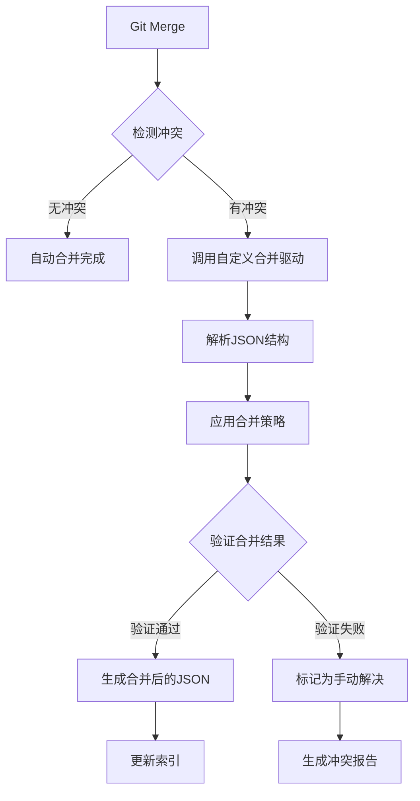

# CodeNexus 协作方案

## 1. 多人协作概述

CodeNexus 支持多人协作的代码库元数据管理，通过 Git 版本控制和智能冲突解决机制，确保团队成员可以安全地并行工作，同时保持数据的一致性和完整性。

### 1.1 协作模式

**项目级隔离**
- 每个代码库维护独立的 `.codenexus/` 目录
- 元数据与项目代码一起进行版本控制
- 支持项目克隆时自动继承元数据

**分布式协作**
- 基于 Git 的分布式版本控制
- 支持离线工作和异步协作
- 自动同步和冲突检测

**权限管理**
- 基于 Git 仓库的访问权限
- 支持只读和读写权限控制
- 操作审计和变更追踪

### 1.2 协作优势

- **数据一致性**：通过版本控制保证数据的一致性
- **变更追踪**：完整的操作历史和变更记录
- **冲突解决**：智能的冲突检测和自动合并
- **团队同步**：实时的数据同步和通知机制

## 2. JSON 冲突处理策略

### 2.1 冲突检测机制

**文件级冲突检测**
- 基于 Git 的三路合并算法
- 检测 JSON 结构的语义冲突
- 识别并发修改的数据项

**数据级冲突分类**
- **标签冲突**：同一文件的标签被不同用户修改
- **注释冲突**：同一文件的注释被并发编辑
- **关系冲突**：文件关系被同时创建或删除
- **元数据冲突**：文件基本信息的并发修改

### 2.2 自动合并策略

**标签合并：并集策略**
```rust
pub fn merge_tags(local_tags: &[String], remote_tags: &[String]) -> Vec<String> {
    let mut merged_tags = HashSet::new();
    
    // 添加本地标签
    for tag in local_tags {
        merged_tags.insert(tag.clone());
    }
    
    // 添加远程标签
    for tag in remote_tags {
        merged_tags.insert(tag.clone());
    }
    
    // 返回去重后的标签列表
    merged_tags.into_iter().collect()
}
```

**注释合并：时间戳优先**
```rust
pub fn merge_comments(
    local_comment: &str, 
    local_time: &str,
    remote_comment: &str, 
    remote_time: &str
) -> (String, String) {
    if remote_time > local_time {
        (remote_comment.to_string(), remote_time.to_string())
    } else {
        (local_comment.to_string(), local_time.to_string())
    }
}
```

**关系合并：智能去重**
```rust
pub fn merge_relationships(
    local_rels: &[Relationship], 
    remote_rels: &[Relationship]
) -> Vec<Relationship> {
    let mut merged = HashMap::new();
    
    // 添加本地关系
    for rel in local_rels {
        let key = (rel.target.clone(), rel.rel_type.clone());
        merged.insert(key, rel.clone());
    }
    
    // 合并远程关系（覆盖相同的关系）
    for rel in remote_rels {
        let key = (rel.target.clone(), rel.rel_type.clone());
        merged.insert(key, rel.clone());
    }
    
    merged.into_values().collect()
}
```

### 2.3 冲突解决流程



## 3. Git 集成配置

### 3.1 自定义合并驱动

**配置合并驱动**
```bash
# 全局配置
git config --global merge.codenexus-json.name "CodeNexus JSON merge driver"
git config --global merge.codenexus-json.driver "codenexus merge %O %A %B"

# 项目配置
git config merge.codenexus-json.name "CodeNexus JSON merge driver"
git config merge.codenexus-json.driver "codenexus merge %O %A %B"
```

**Git 属性配置**
```gitattributes
# .gitattributes
.codenexus/data/metadata.json merge=codenexus-json
```

### 3.2 版本控制策略

**包含在版本控制中**
```gitignore
# 包含的文件
.codenexus/data/metadata.json
.codenexus/config/project.toml
```

**排除在版本控制外**
```gitignore
# .gitignore
.codenexus/database/
.codenexus/logs/
.codenexus/temp/
.codenexus/cache/
```

### 3.3 Git 钩子集成

**pre-commit 钩子**
```bash
#!/bin/bash
# .git/hooks/pre-commit

echo "Validating CodeNexus metadata..."

# 验证 JSON 格式
if ! codenexus validate --quiet; then
    echo "Error: Invalid metadata format"
    exit 1
fi

# 重建索引
codenexus rebuild-index --quiet

echo "CodeNexus validation passed"
```

**post-merge 钩子**
```bash
#!/bin/bash
# .git/hooks/post-merge

echo "Updating CodeNexus indexes after merge..."

# 检查是否有冲突标记
if codenexus check-conflicts; then
    echo "Warning: Merge conflicts detected in metadata"
    echo "Run 'codenexus resolve-conflicts' to fix"
fi

# 更新搜索索引
codenexus update-index --quiet

echo "CodeNexus indexes updated"
```

## 4. 协作工作流

### 4.1 标准工作流程

**1. 开始工作**
```bash
# 拉取最新代码
git pull origin main

# 创建功能分支
git checkout -b feature/add-user-module

# 验证 CodeNexus 状态
codenexus status
```

**2. 添加元数据**
```bash
# 添加标签
codenexus add-tag src/user.rs backend user-management

# 添加注释
codenexus add-comment src/user.rs "用户管理模块，处理用户注册和认证"

# 创建关系
codenexus create-relationship src/main.rs src/user.rs imports
```

**3. 提交变更**
```bash
# 提交代码和元数据
git add .
git commit -m "Add user management module with metadata"

# 推送到远程分支
git push origin feature/add-user-module
```

**4. 合并到主分支**
```bash
# 切换到主分支
git checkout main

# 合并功能分支
git merge feature/add-user-module

# 如果有冲突，解决冲突
codenexus resolve-conflicts

# 推送合并结果
git push origin main
```

### 4.2 冲突解决工作流

**自动解决**
```bash
# 检查冲突状态
codenexus check-conflicts

# 自动解决简单冲突
codenexus resolve-conflicts --auto

# 验证解决结果
codenexus validate
```

**手动解决**
```bash
# 查看冲突详情
codenexus show-conflicts

# 手动编辑冲突文件
vim .codenexus/data/metadata.json

# 验证修改结果
codenexus validate

# 标记冲突已解决
git add .codenexus/data/metadata.json
git commit -m "Resolve metadata conflicts"
```

## 5. 团队协作最佳实践

### 5.1 元数据管理规范

**标签命名规范**
- 使用小写字母和连字符
- 保持标签的一致性和可预测性
- 定期清理不再使用的标签

**注释编写规范**
- 使用清晰、简洁的语言
- 包含必要的上下文信息
- 定期更新过时的注释

**关系建立规范**
- 明确关系的类型和方向
- 提供有意义的关系描述
- 避免创建冗余的关系

### 5.2 协作沟通机制

**变更通知**
- 重要元数据变更及时通知团队
- 使用 Git commit message 说明变更原因
- 在代码审查中包含元数据检查

**冲突协调**
- 遇到复杂冲突时及时沟通
- 建立元数据变更的优先级规则
- 定期同步团队的元数据策略

**知识共享**
- 定期分享元数据的使用技巧
- 建立团队的标签和注释标准
- 培训新成员使用 CodeNexus

### 5.3 质量保证措施

**数据验证**
- 提交前自动验证数据格式
- 定期检查数据的完整性
- 监控数据质量指标

**备份策略**
- 定期备份重要的元数据
- 建立数据恢复机制
- 测试备份和恢复流程

**性能监控**
- 监控合并操作的性能
- 优化大型项目的协作效率
- 定期清理和优化数据

---

**相关文档**：
- [数据存储设计](./数据存储设计.md) - 了解数据结构和存储方案
- [技术架构](./技术架构.md) - 查看系统架构设计
- [MCP接口规范](./MCP接口规范.md) - 了解接口定义

**文档版本**：v2.0  
**创建日期**：2025-07-01  
**最后更新**：2025-07-01
