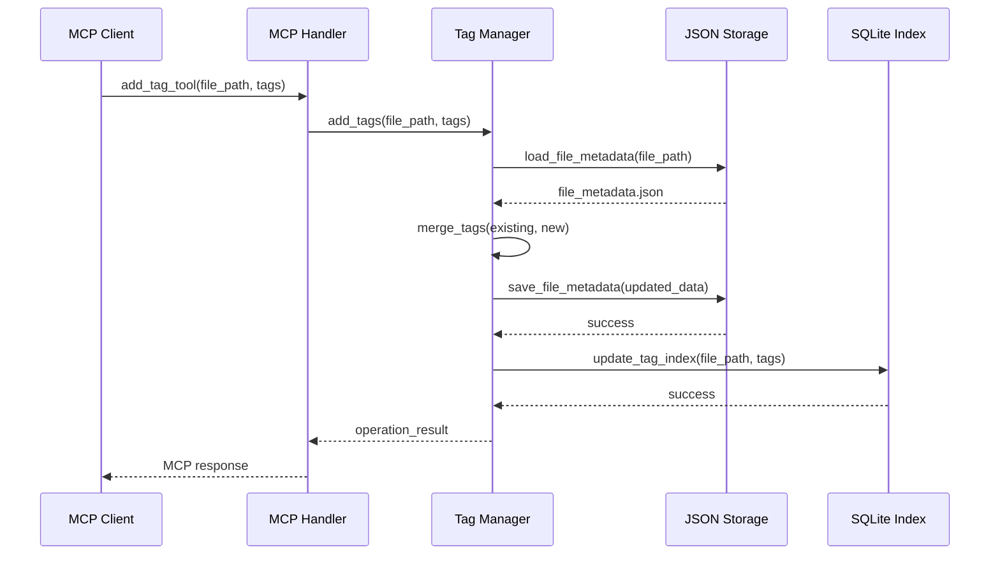
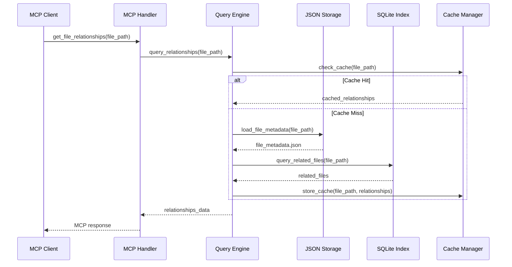
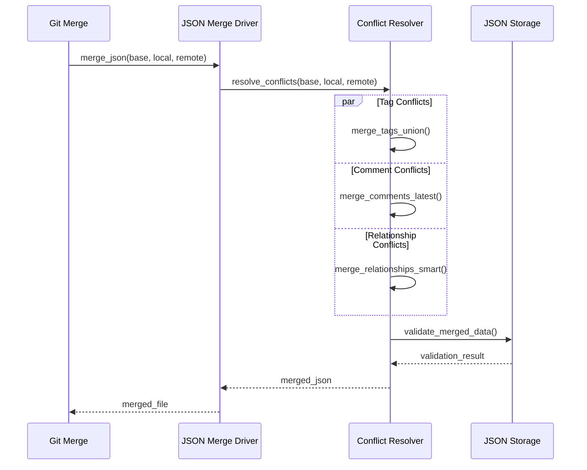

# CodeNexus 技术架构

## 1. 系统整体架构

### 1.1 分层架构设计

```
┌─────────────────────────────────────────────────────────────┐
│                    MCP Client Layer                         │
│            (Claude Desktop, IDEs, etc.)                     │
└─────────────────────────────────────────────────────────────┘
                              │
                              │ MCP Protocol (JSON-RPC)
                              ▼
┌─────────────────────────────────────────────────────────────┐
│                 CodeNexus MCP Server                        │
│  ┌─────────────────────────────────────────────────────────┐ │
│  │                  MCP Handler Layer                      │ │
│  │    Resources Handler | Tools Handler | Prompts Handler  │ │
│  └─────────────────────────────────────────────────────────┘ │
│  ┌─────────────────────────────────────────────────────────┐ │
│  │                 Business Logic Layer                    │ │
│  │   File Manager | Tag Manager | Comment Manager          │ │
│  │   Relationship Manager | Query Engine                   │ │
│  └─────────────────────────────────────────────────────────┘ │
│  ┌─────────────────────────────────────────────────────────┐ │
│  │                 Data Access Layer                       │ │
│  │        JSON Storage | SQLite Index | Cache              │ │
│  └─────────────────────────────────────────────────────────┘ │
└─────────────────────────────────────────────────────────────┘
                              │
                              ▼
┌─────────────────────────────────────────────────────────────┐
│                    File System Layer                        │
│              (.codenexus/ + Source Files)                   │
└─────────────────────────────────────────────────────────────┘
```

### 1.2 架构层次说明

**MCP Client Layer（MCP 客户端层）**
- Claude Desktop、IDE 插件、其他 MCP 兼容客户端
- 通过标准 MCP 协议与服务器通信
- 提供用户交互界面和体验

**MCP Handler Layer（MCP 处理层）**
- 负责 MCP 协议的解析和响应
- 将 MCP 请求转换为内部业务逻辑调用
- 处理协议级别的错误和异常

**Business Logic Layer（业务逻辑层）**
- 实现核心业务功能和规则
- 提供统一的业务接口
- 处理复杂的业务逻辑和数据验证

**Data Access Layer（数据访问层）**
- 抽象数据存储和访问逻辑
- 提供统一的数据操作接口
- 处理数据缓存和性能优化

**File System Layer（文件系统层）**
- 直接与本地文件系统交互
- 管理项目文件和元数据文件
- 处理文件监控和变更检测

## 2. 核心模块设计

### 2.1 MCP Handler Layer

**Resources Handler**
- 处理 MCP 资源请求
- 提供文件元数据、标签列表、关系图等资源
- 支持资源订阅和变更通知

**Tools Handler**
- 执行 MCP 工具调用
- 实现标签管理、注释管理、关系管理等操作
- 提供操作结果反馈和错误处理

**Prompts Handler**
- 管理预定义的提示模板
- 支持参数化提示生成
- 提供上下文感知的智能提示

### 2.2 Business Logic Layer

**File Manager**
- 文件扫描和索引
- 文件变更监控
- 文件基本信息管理

**Tag Manager**
- 标签的增删改查
- 标签分类和层次管理
- 标签统计和分析

**Comment Manager**
- 注释的存储和检索
- 全文搜索功能
- 注释版本管理

**Relationship Manager**
- 关系的建立和维护
- 关系图谱构建
- 关系查询和分析

**Query Engine**
- 复合查询处理
- 查询优化和缓存
- 结果排序和分页

### 2.3 Data Access Layer

**JSON Storage**
- 元数据的持久化存储
- 事务性操作支持
- 数据备份和恢复

**SQLite Index**
- 全文搜索索引
- 查询性能优化
- 统计数据缓存

**Cache Manager**
- 内存缓存管理
- 缓存策略和失效
- 性能监控和调优

## 3. 关键操作时序图

### 3.1 添加文件标签时序图



### 3.2 查询文件关系时序图



### 3.3 Git 合并冲突处理时序图



## 4. 技术选型

### 4.1 开发语言

**Rust**
- 高性能和内存安全
- 优秀的异步编程支持
- 丰富的生态系统
- 跨平台兼容性

### 4.2 核心依赖

**MCP 协议实现**
```toml
rmcp = { version = "0.1", features = ["server"] }
```

**异步运行时**
```toml
tokio = { version = "1.0", features = ["full"] }
```

**序列化框架**
```toml
serde = { version = "1.0", features = ["derive"] }
serde_json = "1.0"
```

**数据库**
```toml
rusqlite = { version = "0.29", features = ["bundled"] }
```

**文件系统操作**
```toml
walkdir = "2.3"
notify = "6.0"
```

### 4.3 架构原则

**单一职责**
- 每个模块专注于特定功能
- 清晰的接口边界
- 低耦合高内聚

**可扩展性**
- 插件化架构设计
- 标准化接口定义
- 配置驱动的功能开关

**性能优化**
- 异步 I/O 操作
- 智能缓存策略
- 索引优化查询

**错误处理**
- 分层错误处理机制
- 详细的错误信息
- 优雅的降级策略

## 5. 部署架构

### 5.1 单机部署

```
┌─────────────────────────────────────┐
│           Local Machine             │
│  ┌─────────────────────────────────┐ │
│  │        MCP Client               │ │
│  │    (Claude Desktop)             │ │
│  └─────────────────────────────────┘ │
│                │                    │
│                ▼                    │
│  ┌─────────────────────────────────┐ │
│  │      CodeNexus Server           │ │
│  │        (Binary)                 │ │
│  └─────────────────────────────────┘ │
│                │                    │
│                ▼                    │
│  ┌─────────────────────────────────┐ │
│  │       Project Files             │ │
│  │    (.codenexus/metadata)        │ │
│  └─────────────────────────────────┘ │
└─────────────────────────────────────┘
```

### 5.2 团队协作部署

```
┌─────────────────┐    ┌─────────────────┐
│   Developer A   │    │   Developer B   │
│                 │    │                 │
│  ┌─────────────┐│    │┌─────────────┐  │
│  │ CodeNexus   ││    ││ CodeNexus   │  │
│  │   Server    ││    ││   Server    │  │
│  └─────────────┘│    │└─────────────┘  │
└─────────────────┘    └─────────────────┘
         │                       │
         └───────────┬───────────┘
                     │
                     ▼
         ┌─────────────────────────┐
         │      Git Repository     │
         │   (.codenexus/data/)    │
         └─────────────────────────┘
```

---

**相关文档**：
- [项目概述](./项目概述.md) - 了解项目背景和功能
- [数据存储设计](./数据存储设计.md) - 查看数据组织方案
- [MCP接口规范](./MCP接口规范.md) - 了解接口实现

**文档版本**：v2.0  
**创建日期**：2025-07-01  
**最后更新**：2025-07-01
