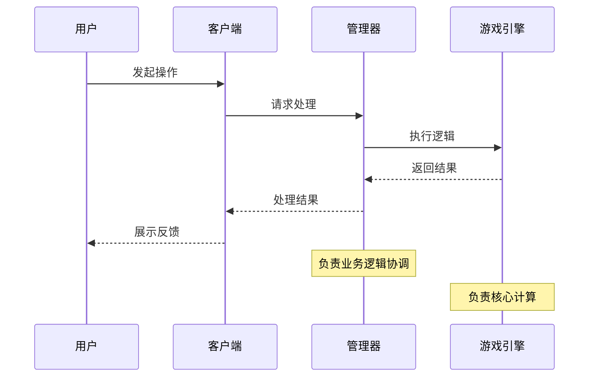

# 文档规范

## 概述
本文档旨在为项目中的所有文档提供统一的命名、格式和结构规范，以确保文档的一致性、可读性和可维护性，从而提高团队协作效率。

## 术语与概念定义
- **模块/主题**: 文档所属的功能模块或主要内容。
- **简要描述**: 对文档内容的精炼概括。
- **版本号**: 用于追踪文档修订历史的标识。
- **Markdown (.md)**: 一种轻量级标记语言，用于文档编写。

## 1. 文件夹分类
所有文档应根据其类型存放在 `docs/` 目录下的相应子文件夹中。这种分类方式使得文件组织更加直观和清晰。

```
docs/
├── requirements/  # 存放所有需求文档
├── design/        # 存放所有设计文档
├── implementation/ # 存放所有实施方案文档
├── rules/         # 存放所有规则文档
├── architecture/  # 存放所有架构文档
├── guidelines/    # 存放所有规范/指南文档
└── ...            # 其他类型文档
```

## 2. 文档命名规范（通用）
所有文档的文件名应遵循以下格式，以确保一致性和可读性：

`[模块/主题]_[简要描述]_[版本号].md`

**说明：**
- `[模块/主题]`：文档所属的模块或主要主题，使用小写字母和下划线连接，例如 `game_flow`, `combat_system`, `skill_cards`。
- `[简要描述]`：对文档内容的简要概括，使用小写字母和下划线连接，例如 `new_iteration`, `refactor_plan`, `hand_area_design`。
- `[版本号]`：可选，用于表示文档的版本，例如 `v1.0`, `v1.1`。如果文档会频繁更新且需要版本追踪，则建议使用。如果文档内容稳定且无需频繁版本迭代，可以省略。

**示例：**
- `docs/requirements/game_flow_new_iteration_v1.0.md` (游戏流程新迭代需求)
- `docs/design/combat_system_refactor_plan.md` (战斗系统重构设计)
- `docs/guidelines/code_organization.md` (代码组织规范)

### 2.1 需求文档命名规范（在 `docs/requirements/` 文件夹内）
`[功能模块]_[功能名称]_requirements.md`

**示例：**
- `game_flow_initial_card_selection_requirements.md` (游戏流程初始卡牌选择需求)
- `skill_card_hand_area_requirements.md` (技能卡手牌区域需求)

### 2.2 设计文档命名规范（在 `docs/design/` 文件夹内）
`[功能模块]_[功能名称]_design.md`

**示例：**
- `combat_system_refactor_design.md` (战斗系统重构设计)
- `skill_card_hand_area_design.md` (技能卡手牌区域设计)

## 3. 文档格式
所有文档统一使用 **Markdown (.md)** 格式。

**优点：**
- 易于编写和阅读。
- 兼容性强，可在多种平台和工具中查看。
- 支持代码块、列表、表格等常用格式。

## 4. 文档内容结构
为了保持文档内容的清晰和一致性，建议文档包含以下基本结构：

**1. 标题：**
   - 使用一级标题 (`#`) 作为文档主标题。

**2. 概述：**
   - 简要介绍文档的目的、范围和主要内容。

**3. 术语与概念定义：**
   - 列出文档中使用的关键术语和概念，并提供清晰的定义。这有助于读者在阅读正文前建立统一的理解。

**4. 背景（可选）：**
   - 描述文档产生的背景、相关问题或现有情况。

**5. 时序图（设计文档特有）：**
   - 使用Mermaid时序图描述系统组件间的交互流程
   - 必须包含主要的用例场景和数据流
   - 时序图应清晰展示各组件的职责分工和调用关系

**6. 详细内容：**
   - 根据文档类型，详细描述需求、设计、规则等。
   - 使用二级标题 (`##`)、三级标题 (`###`) 等进行分层。
   - 善用列表、代码块、表格、图片等来增强可读性。

**7. 风险与挑战（可选）：**
   - 列出可能存在的风险、挑战和应对措施。

**8. 验收标准（需求文档特有）：**
   - 明确功能完成的衡量标准。

**9. 实施计划（实施文档特有）：**
   - 描述功能的实现步骤和时间规划。

**10. 附录（可选）：**
   - 包含相关参考资料等。

## 5. 文档长度与LLM友好性要求

### 5.1 文档长度控制
为确保文档对LLM（大语言模型）友好，所有文档应遵循以下长度要求：

**长度限制**：
- 单个文档不应超过300行
- 如果内容超过300行，必须进行拆分

**拆分原则**：
1. **按功能模块拆分**: 将不同功能模块的设计分别成文档
2. **按层次拆分**: 将概述、详细设计、实现细节分别成文档
3. **按时间阶段拆分**: 将不同开发阶段的内容分别成文档

### 5.2 文档导读要求
当文档需要拆分时，必须提供导读文档：

**导读文档命名**：`[模块]_[功能]_overview.md`

**导读文档内容**：
1. **文档结构说明**: 列出所有相关文档及其关系
2. **阅读顺序建议**: 推荐的文档阅读顺序
3. **快速索引**: 各文档的核心内容摘要
4. **文档间关联**: 说明文档间的依赖和引用关系

**示例**：
```markdown
# 游戏流程系统文档导读

## 文档结构
1. `game_flow_overview.md` - 系统概述（本文档）
2. `game_flow_design.md` - 详细设计
3. `game_flow_implementation.md` - 实施方案

## 推荐阅读顺序
新读者: 概述 → 设计 → 实施
开发者: 设计 → 实施
维护者: 实施 → 设计
```

### 5.3 LLM友好性原则
1. **结构清晰**: 使用标准的Markdown层级结构
2. **内容聚焦**: 每个文档专注于单一主题
3. **引用明确**: 文档间引用使用相对路径
4. **术语统一**: 在术语定义部分明确关键概念
5. **代码适量**: 避免在文档中包含大量代码，影响阅读体验

### 5.4 代码内容限制
**代码使用原则**：
- **最小化原则**: 仅包含必要的代码示例和接口定义
- **示例优先**: 优先使用简短的代码示例说明概念
- **引用替代**: 大量代码应放在实际代码文件中，文档中仅引用
- **伪代码可选**: 复杂逻辑可使用伪代码或流程图描述

**不建议的做法**：
- ❌ 在文档中包含完整的类实现
- ❌ 复制粘贴大段实际代码
- ❌ 包含详细的API参考（应独立成文档或注释）
- ❌ 在设计文档中包含具体实现代码

**推荐的做法**：
- ✅ 使用简短的接口定义说明设计
- ✅ 提供关键方法的签名示例
- ✅ 使用伪代码描述算法流程
- ✅ 通过相对路径引用实际代码文件

## 6. 设计文档时序图规范

### 6.1 时序图要求
所有设计文档必须包含时序图部分，用于清晰描述系统组件间的交互流程和数据流向。

### 6.2 时序图格式
- **工具**: 统一使用Mermaid语法绘制时序图
- **语法**: 使用`sequenceDiagram`类型
- **代码块**: 使用```mermaid标记包围

### 6.3 时序图内容要求
**必须包含的元素**：
1. **参与者(Participants)**: 明确标识所有参与交互的组件、模块或角色
2. **主要用例**: 覆盖核心功能的完整交互流程
3. **数据流**: 清晰展示数据在组件间的传递方向和内容
4. **职责分工**: 体现各组件的具体职责和边界

**推荐包含的元素**：
1. **循环逻辑**: 使用`loop`标记重复性操作
2. **条件分支**: 使用`alt/else`标记条件判断
3. **注释说明**: 使用`Note`为关键步骤添加说明
4. **激活框**: 使用`activate/deactivate`标记组件活跃状态

### 6.4 时序图示例


### 6.5 时序图质量标准
1. **完整性**: 覆盖设计的主要交互场景
2. **准确性**: 与实际设计保持一致
3. **清晰性**: 参与者命名清晰，交互步骤明确
4. **层次性**: 体现系统的分层架构和职责分离
