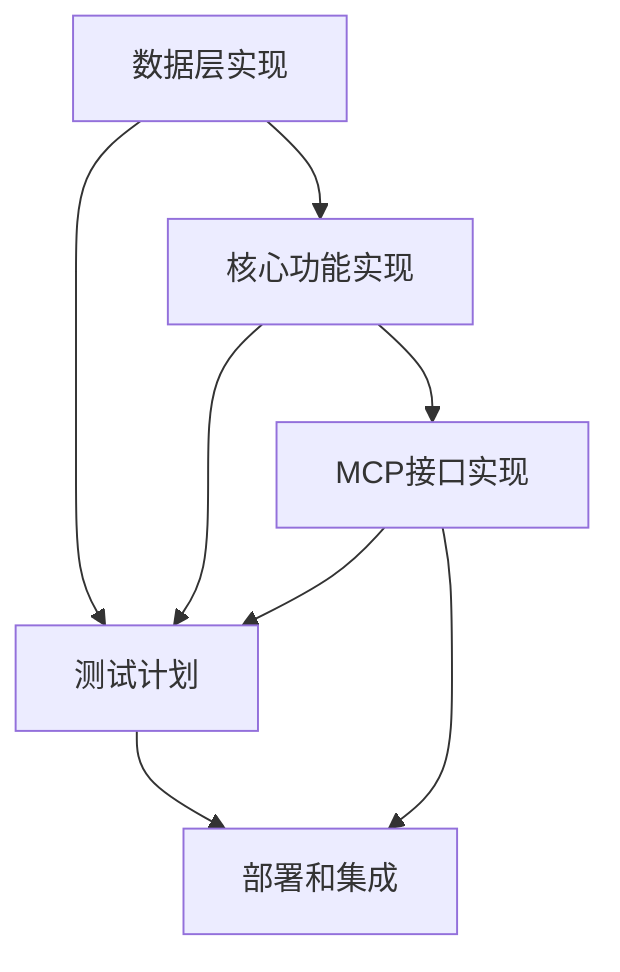

# CodeNexus 实现计划导航

本目录包含 CodeNexus 项目的详细实现计划文档，按功能模块拆分为多个独立文档，为开发团队提供清晰的实施指导。

## 📚 文档结构

### [1. 数据层实现计划](./数据层实现计划.md)
- JSON 存储层实现
- SQLite 索引层实现
- 缓存机制实现
- 数据一致性保证
- **状态**：基础架构，优先级最高
- **预估周期**：6周（第1-6周）

### [2. 核心功能实现计划](./核心功能实现计划.md)
- 文件管理器模块
- 标签管理器模块
- 注释管理器模块
- 关系管理器模块
- 查询引擎模块
- **状态**：核心业务逻辑
- **预估周期**：7周（第7-13周）

### [3. MCP接口实现计划](./MCP接口实现计划.md)
- MCP 协议基础架构
- Resources 接口实现
- Tools 接口实现
- Prompts 接口实现
- 协议优化和扩展
- **状态**：对外接口层
- **预估周期**：6周（第14-19周）

### [4. 测试计划](./测试计划.md)
- 单元测试策略
- 集成测试方案
- 性能测试计划
- 兼容性测试
- **状态**：质量保证
- **预估周期**：5周（第20-24周）

### [5. 部署和集成计划](./部署和集成计划.md)
- 项目初始化系统
- Git 集成配置
- 配置管理系统
- 发布和分发流程
- **状态**：部署和运维
- **预估周期**：6周（第25-30周）

## 🔗 实施依赖关系

### 关键依赖说明
- **数据层** 是所有其他模块的基础，必须优先完成
- **核心功能** 依赖数据层，为 MCP 接口提供业务逻辑
- **MCP接口** 依赖核心功能，是系统的对外入口
- **测试计划** 贯穿所有开发阶段，确保质量
- **部署集成** 依赖前面所有模块，是最终交付

## 📋 总体实施计划

### 第一阶段：基础建设（第1-6周）
**目标**：建立稳定的数据存储基础
- ✅ 完成 JSON + SQLite 混合存储架构
- ✅ 实现数据同步和缓存机制
- ✅ 建立查询引擎基础

**关键里程碑**：
- 里程碑 1.1：基础存储（第1-2周）
- 里程碑 1.2：索引同步（第3-4周）
- 里程碑 1.3：缓存优化（第5周）
- 里程碑 1.4：查询基础（第6周）

### 第二阶段：核心功能（第7-13周）
**目标**：实现完整的业务逻辑功能
- ✅ 完成五大核心管理器模块
- ✅ 建立模块间协调机制
- ✅ 实现高级查询和分析功能

**关键里程碑**：
- 里程碑 2.1：文件和标签管理（第7-8周）
- 里程碑 2.2：注释和关系管理（第9-10周）
- 里程碑 2.3：查询引擎（第11-12周）
- 里程碑 2.4：模块集成（第13周）

### 第三阶段：接口实现（第14-19周）
**目标**：完成 MCP 协议接口实现
- ✅ 建立完整的 MCP 协议支持
- ✅ 实现 Resources、Tools、Prompts 接口
- ✅ 优化协议性能和扩展性

**关键里程碑**：
- 里程碑 3.1：协议基础（第14-15周）
- 里程碑 3.2：Resources 接口（第16周）
- 里程碑 3.3：Tools 和 Prompts（第17-18周）
- 里程碑 3.4：优化和扩展（第19周）

### 第四阶段：测试验证（第20-24周）
**目标**：确保系统质量和稳定性
- ✅ 完成全面的测试覆盖
- ✅ 验证性能和兼容性
- ✅ 确保用户体验质量

**关键里程碑**：
- 里程碑 4.1：单元测试（第20-21周）
- 里程碑 4.2：集成测试（第22周）
- 里程碑 4.3：性能测试（第23周）
- 里程碑 4.4：兼容性测试（第24周）

### 第五阶段：部署发布（第25-30周）
**目标**：完成系统部署和发布准备
- ✅ 建立完整的部署流程
- ✅ 实现 Git 深度集成
- ✅ 准备正式发布版本

**关键里程碑**：
- 里程碑 5.1：初始化和配置（第25-26周）
- 里程碑 5.2：Git 集成（第27周）
- 里程碑 5.3：服务器部署（第28周）
- 里程碑 5.4：发布准备（第29-30周）

## 🎯 关键成功因素

### 技术架构
- **模块化设计**：确保各模块的独立性和可测试性
- **性能优化**：重点关注查询性能和内存使用
- **错误处理**：建立完善的错误处理和恢复机制

### 开发流程
- **测试驱动**：每个模块都要有充分的测试覆盖
- **增量开发**：按里程碑逐步交付可用功能
- **持续集成**：建立自动化的构建和测试流程

### 质量保证
- **代码审查**：确保代码质量和一致性
- **性能监控**：持续监控系统性能指标
- **用户反馈**：及时收集和处理用户反馈

## 📊 进度跟踪

### 当前状态
- **设计阶段**：✅ 已完成
- **实现阶段**：🚧 准备开始
- **测试阶段**：⏳ 待开始
- **部署阶段**：⏳ 待开始

### 风险管控
- **技术风险**：Rust 生态和 MCP 协议的学习曲线
- **进度风险**：复杂功能的实现时间可能超出预期
- **质量风险**：需要确保充分的测试覆盖

## 🧭 相关文档导航

- **设计文档**：[设计文档导航](../design/README.md)
- **需求文档**：[需求文档](../requirements/需求文档.md)
- **项目根目录**：[返回项目根目录](../../README.md)

## 📝 文档维护

- 每个实现计划文档都是独立可读的
- 文档间通过相对链接建立关联
- 实施过程中需要及时更新进度状态
- 重大变更需要同步更新相关文档

---

**文档版本**：v1.0  
**创建日期**：2025-07-01  
**最后更新**：2025-07-01  
**总预估工期**：30周（约7.5个月）
